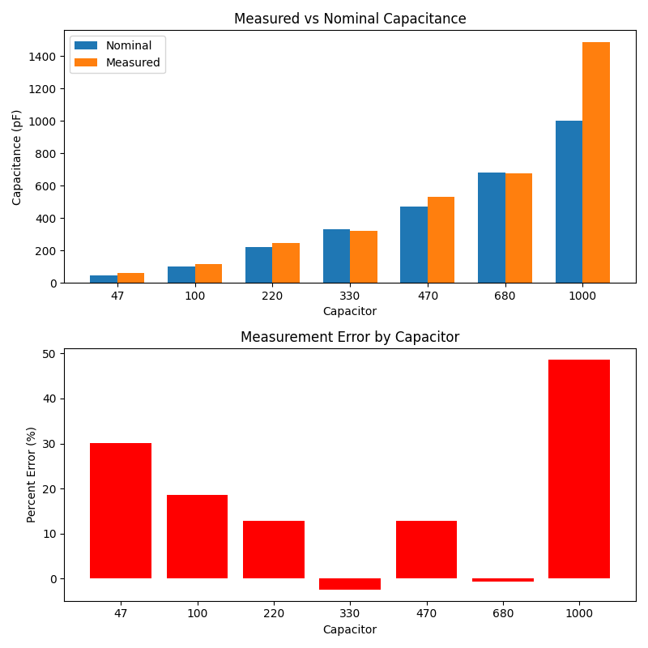
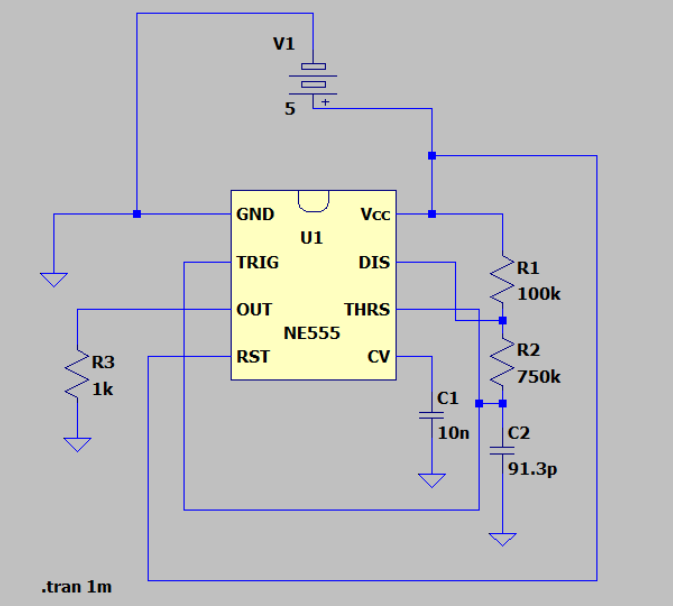

# Capacitance-Dielectric-Meter

## Overview
This project is a capacitance meter built around a 555 timer astable 
oscillator and an Arduino Uno. An unknown capacitor placed in the 555 timing 
network directly controls the oscillation frequency; the Arduino measures 
that frequency and calculates capacitance using the 555 timing equation. 
The original goal was to extend this into dielectric constant characterization 
using a hand-built parallel plate capacitor, but inconsistent foil-to-plate 
contact made that approach unreliable. The project instead pivoted to a 
rigorous accuracy validation against a set of known capacitors, which revealed 
a clear, well-understood relationship between measurement error and operating 
frequency, itself a valuable characterization result, and one I plan to 
extend to dielectric materials once the physical plate fixture is improved.
## Theory

### 555 astable timing equation
The capacitor charges toward Vcc from Vi 1/3Vcc. Using the general Rc charging eqn:

V(t) = Vcc - 2/3Vcc * e(-t/tau)

Solve for the time to reach 2/3Vcc
Set V(t) = 2/3Vcc

2/3Vcc = Vcc - 2/3Vcc * e(-t/tau) --->
2/3Vcc - Vcc = -2/3Vcc * e(-t/tau) --->
-1/3Vcc = -2/3Vcc * e(-t/tau) --->
1/2 = e(-t/tau) --->
-t/tau = ln(1/2) --->
-t/tau = -ln(2) --->
t = ln(2) * tau --->
t = 0.693 * tau 

This gives the charge and discharge times of:
 - t_charge = 0.693 * (R1 + R2) * C
 - t_discharge = 0.693 * R2 * C
 - t_tot = 0.693 * (R1 + 2R2) * C
 - f = 1.44/((R1+2R2) * C)
   
### Capacitance equation, using frequency
Rearranging the timing equation:
C = 1.44/((R1+2R2) * f)

### Dielectric Constant equation, using Capacitance
Using the parallel plate capacitor equation:
C = (ε_r)((ε_0) * A/d

Solving for ε_r:
ε_r = C/((ε_0) * A/d)

## Hardware 
 - Arduino Uno
 - 1k Ohm Resistor
 - 100k Ohm Resistor
 - 750k Ohm Resistor
 - 555 timing chip
 - 10nF Capacitor
 - Capacitor assortment kit (used 47pf - 1000pF) for accurency validation testing
 - 4'' x 4'' aluminum foil parallel plate capacitor with ~1mm cardboard spacer 
   (attempted dielectric test fixture, see Limitations)
## Software

### Arduino Sketch
Uses a digital input pin to measure the full period of the 555 output square 
wave using pulseIn(). Calculates frequency from the period, then derives 
capacitance using the 555 timing equation and dielectric constant using the 
parallel plate capacitor equation. Outputs all three values over serial at 
9600 baud every 500ms.

### Pyton Script
Establishes a serial connection with the Arduino over USB and continuously 
reads frequency, capacitance, and dielectric constant values in real time. 
Stores all readings in lists and upon termination plots three separate graphs 
using matplotlib. 

**Libraries used:**
- pyserial — serial communication with Arduino
- matplotlib — data plotting
- time — serial connection delay on startup

## Results
To validate the meter's accuracy, I tested 7 capacitors with known nominal 
values ranging from 47pF to 1000pF. For each capacitor, the Arduino measured 
the 555 oscillator's period, calculated frequency, and derived capacitance 
using the timing equation. Readings were logged via a Python serial script, 
and a second Python script generated comparison bar charts plotting measured 
values against nominal values, along with percent error for each capacitor.

A clear pattern emerged across the tested range: error was highest at both 
extremes and lowest near the circuit's designed operating frequency. The 47pF 
capacitor operates at roughly 42kHz, while the 1000pF capacitor operates at 
roughly 200Hz, both approaching the practical limits of the pulseIn() 
function used for timing. Capacitors operating in the 3-9kHz range, closer to 
the resistor values' designed target frequency, produced the most accurate 
readings.

At high frequencies, the signal period becomes comparable in magnitude to 
pulseIn()'s own function call overhead (roughly 1-3 microseconds), causing 
that overhead to make up a significant fraction of the measured time and 
introducing error. At low frequencies, the much longer measurement window 
gives more time for circuit noise, 555 non-idealities, and breadboard 
parasitics to perturb the threshold-crossing timing, reducing accuracy in the 
opposite direction.
## How to Run

### 555 timer Wiring
- Pin 1 (GND): Ground
- Pin 2 (TRIG): Junction of unknown capacitor & R2 (750kΩ)
- Pin 3 (OUT): Arduino Pin 2 & 1kΩ load resistor --> GND
- Pin 4 (RESET): 5V (tied high, disables reset)
- Pin 5 (CTRL): 10nF bypass capacitor --> GND
- Pin 6 (THR): Junction of unknown capacitor & R2 (750kΩ)
- Pin 7 (DIS): Junction of R1 (100kΩ) & R2 (750kΩ)
- Pin 8 (VCC): 5V supply & top of R1 (100kΩ)

### Running the Project

1. **Upload the Arduino sketch:** Open `Capacitance_test.ino` in the Arduino 
   IDE, select your board (Arduino Uno) and COM port under Tools, then click 
   Upload. The Arduino will begin measuring frequency continuously and 
   printing frequency, capacitance, and dielectric constant values over 
   serial.

2. **Run the Python script:** Close the Arduino Serial Monitor (it locks the 
   COM port), then run `python capacitance_meter.py` from a terminal (I used IDLE) in the 
   project folder. Update the COM port in the script if it differs from 
   your COM. The script will read live data from the Arduino and print it to the 
   terminal in real time.

3. **Generate the results comparison chart:** Run `python Capacitance_bargraph.py`
   using your own recorded nominal vs (average) measured values, or your own collected dataset.
   This produces the two-panel comparison chart showing measured vs nominal capacitance and 
   percent error.

4. **Expected output:** When running correctly, the live serial script 
   prints a frequency, capacitance, and dielectric constant reading roughly 
   every second. The bar chart script produces two plots; one comparing 
   nominal vs measured capacitance values, and another showing percent error 
   for each capacitor tested.

## Limitations & Future Work

The original goal of this project included characterizing the dielectric 
constant of real materials (paper, cardboard, plastic) using a hand-built 
parallel plate capacitor made from aluminum foil and a cardboard spacer. In 
practice, this fixture produced inconsistent and unreliable readings, 
occasional measurements landed close to the expected value, but most did not, 
likely due to uneven plate flatness and inconsistent wire-to-foil contact 
using taped bare wire connections rather than soldered or clipped joints. 
Given the resources on hand at the time, this could not be resolved reliably, 
so the project pivoted to validating the meter's accuracy against a set 
of known capacitors instead.

A more rigorous version of the dielectric fixture would use alligator clips 
or soldered leads for consistent electrical contact, and a rigid, rather than cut 
cardboard to guarantee uniform plate separation across the full plate area. With that 
fixture in place, the same measurement and analysis system I built would 
transfer directly to dielectric characterization.

Separately, the accuracy analysis in this project also identified the 
instrument's reliable operating range as roughly 3-9kHz, corresponding to 
capacitance values in the few-hundred-picofarad range. Extending that range  
through switchable resistor values or a different timing IC would make the 
meter useful across a wider span of real-world components.
